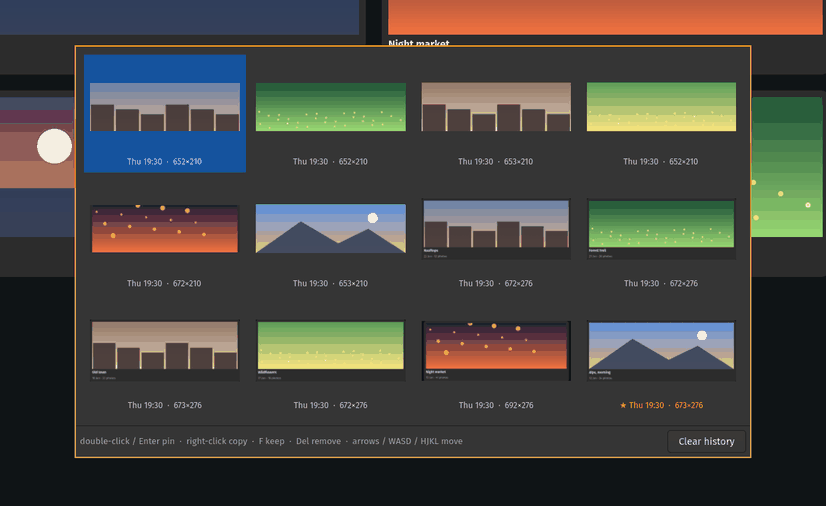

<div align="center">
  
  <h1>snip-pin</h1>
  <p>Snip and pin for Hyprland, the Snipaste way</p>
  <a href="https://github.com/felsenuboot/snip-pin/actions/workflows/ci.yml"></a>
  <a href="https://github.com/felsenuboot/snip-pin/releases"></a>
</div>

snip-pin is a screenshot tool for [Hyprland](https://hyprland.org) in the
style of [Snipaste](https://www.snipaste.com). Press a key, pick a region, a
window or an element inside a window, and the screenshot stays on screen
exactly where it was taken, floating above everything. Drag it around, zoom
it, fade it, annotate it, copy or save it. `slurp`, `grim`, `wl-copy` and a
GTK 4 viewer; no daemon, no portal.

<p align="center">
  
</p>

> [!NOTE]
> A personal project, written largely with Claude Code and reviewed by a
> human, not audited. It works on my machine (Arch, Hyprland). No warranty;
> not affiliated with Snipaste or Hyprland. Issues and pull requests are
> welcome.

## Features

- 📌 **Pins stay put.** Every snip opens as a floating, pinned window at the
  capture position and shows up in the dock like any other window. Hide them
  all and bring them back, or make a pin click-through so it lies over your
  editor while you type underneath.
- 🎯 **Snaps to windows and elements.** Windows and the rectangles inside them
  (images, cards, panels, table cells) highlight under the pointer; a click
  snaps to one, a drag selects freely. Element detection is pure numpy on the
  frozen frame, about 40 ms.
- ✏️ **Annotate on the pin.** Rectangle, ellipse, arrow, pen, text (input
  methods and Compose work), numbered steps, marker, blur, crop, rotate and
  flip, with undo and redo; an eraser, and every annotation can be moved,
  recoloured or removed afterwards. Annotations are baked into what you copy or save; the file on
  disk stays untouched.
- 📋 **Clipboard first.** Every snip lands in the clipboard as well; `Ctrl+C`,
  a double-click or a right-click on a pin copies it again, annotations
  included, as pixels and as a file, and closes it. Copy-only and save-only modes for keys of their own.
- 🕘 **History.** Snips are kept for a week, or for good if you star them: pin
  the last one again, pick one from a thumbnail grid, repeat the last capture
  area, or pin the image that is in the clipboard.
- 🖥️ **Whole screen.** Capture the monitor under the pointer, or every monitor,
  without a selection.
- ⚙️ **A config file.** Keys and mouse buttons rebindable, colours, save and
  autosave folders, the selection's look, all in `~/.config/snip-pin/config`,
  re-read on the fly.
- ⚡ **Fast.** All pins share one process, so a second pin appears in about
  50 ms; the selection is up before the screen has finished freezing.

| Snap to windows and elements | Annotate on the pin |
|---|---|
|  |  |

Hyprland only, for now. Other wlroots compositors are on the roadmap
([milestone v0.4.0](https://github.com/felsenuboot/snip-pin/milestone/3));
GNOME and macOS are not, see [docs/decisions.md](docs/decisions.md).

## Install

Python 3.11+, PyGObject, GTK 4, `grim`, `slurp`, `wl-clipboard` and `jq`.
`hyprpicker` (freezes the screen during selection), `python-numpy` (element
snapping) and `libnotify` (toasts) are optional.

| Distribution | Packages |
| --- | --- |
| Arch | `grim slurp wl-clipboard jq python-gobject gtk4 hyprpicker python-numpy libnotify` |
| Fedora | `grim slurp wl-clipboard jq python3-gobject gtk4 hyprpicker python3-numpy libnotify` |
| Debian, Ubuntu | `grim slurp wl-clipboard jq python3-gi python3-gi-cairo gir1.2-gtk-4.0 python3-numpy libnotify-bin` (no hyprpicker package) |

```
git clone https://github.com/felsenuboot/snip-pin ~/.local/share/snip-pin
~/.local/share/snip-pin/install.sh
```
 `install.sh` adds a desktop
entry and icon so docks show a proper icon for pins, plus an *Open with → Pin
image* entry for file managers, and ends with `snip-pin.sh doctor`, which
lists what is installed and what is missing. `install.sh --uninstall` removes
the entries again.

Bind the script and add a window rule so pins float above everything without
animations, blur, shadows or rounded corners. Hyprland Lua config (0.56+):

```lua
hl.bind("PRINT", hl.dsp.exec_cmd("~/.local/share/snip-pin/snip-pin.sh"), { description = "Snip a region and pin it" })
hl.bind("SHIFT + PRINT", hl.dsp.exec_cmd("~/.local/share/snip-pin/snip-pin.sh last"), { description = "Pin the last snip again" })
hl.bind("SUPER + PRINT", hl.dsp.exec_cmd("~/.local/share/snip-pin/snip-pin.sh history"), { description = "Snip history" })
hl.bind("CTRL + PRINT", hl.dsp.exec_cmd("~/.local/share/snip-pin/snip-pin.sh clipboard"), { description = "Pin the clipboard image" })
hl.bind("SUPER + SHIFT + PRINT", hl.dsp.exec_cmd("~/.local/share/snip-pin/snip-pin.sh screen"), { description = "Pin the whole monitor" })
hl.bind("SUPER + H", hl.dsp.exec_cmd("~/.local/share/snip-pin/snip-pin.sh toggle"), { description = "Hide or show every pin" })

hl.window_rule({
    name = "snip-pin",
    match = { class = "^(snip-pin)$" },
    float = true,
    pin = true,
    no_anim = true,
    no_blur = true,
    no_shadow = true,
    border_size = 0,
    rounding = 0,
})
```

<details>
<summary>Classic <code>hyprland.conf</code></summary>

```
bind = , PRINT, exec, ~/.local/share/snip-pin/snip-pin.sh
bind = SHIFT, PRINT, exec, ~/.local/share/snip-pin/snip-pin.sh last
bind = SUPER, PRINT, exec, ~/.local/share/snip-pin/snip-pin.sh history
bind = CTRL, PRINT, exec, ~/.local/share/snip-pin/snip-pin.sh clipboard
bind = SUPER SHIFT, PRINT, exec, ~/.local/share/snip-pin/snip-pin.sh screen
bind = SUPER, H, exec, ~/.local/share/snip-pin/snip-pin.sh toggle

windowrulev2 = float, class:^(snip-pin)$
windowrulev2 = pin, class:^(snip-pin)$
windowrulev2 = noanim, class:^(snip-pin)$
windowrulev2 = noblur, class:^(snip-pin)$
windowrulev2 = noshadow, class:^(snip-pin)$
windowrulev2 = noborder, class:^(snip-pin)$
windowrulev2 = rounding 0, class:^(snip-pin)$
```

For a drop shadow under pins, leave `no_shadow` out of the rule and let the
compositor draw it. Placement works with both the Lua (0.56+) and the classic dispatcher syntax;
the viewer tries the Lua form first and remembers which one the compositor
accepted.

</details>

## Using a pin

| Action | Input |
|---|---|
| Move | drag with the left mouse button |
| Zoom | mouse wheel or touchpad (10 % steps, around the pointer, the percentage shows briefly) |
| Opacity | `Ctrl` + wheel, `Ctrl+1` resets |
| Rotate, flip | `Ctrl+R` / `Ctrl+Shift+R` a quarter turn, `Ctrl+H` / `Ctrl+J` flip; annotations turn with the image, undoable |
| Thumbnail | `Ctrl+M` or `Shift` + double-click collapses the pin into a 75 px tile at its corner; a click restores it. With the crop tool's marquee drawn, `Shift+Enter` keeps only that part visible as the tile |
| Reset image | `Ctrl+0`: zoom, opacity, rotation, flips and thumbnail back to normal |
| Copy image and close | `Ctrl+C`, double-click or right-click |
| Save to the screenshot folder and close | `Ctrl+S` or the middle-click menu; name from the `filename` pattern, `format` png, jpg or webp |
| Save as… | `Ctrl+Shift+S`: a file dialog preset with the folder, the pattern and the last extension you used; `.png`, `.jpg` or `.webp` picks the encoder. The pin stays open |
| Send to a program | *Open with…* in the menu asks which application; `[commands]` in the config adds your own entries (`Open in GIMP = gimp %f`, an upload script, …) under *Send to*, the first nine on `Ctrl+Shift+1` … `9` |
| Print | `Ctrl+P`: GTK's print dialog with the image and its annotations scaled to fit the page; print to PDF works too |
| Close without copying | `Esc`; `snip-pin.sh reopen` brings the last closed pin back where it was, with zoom, opacity and annotations. `Shift+Esc` destroys it for good |
| Click-through | `Ctrl+T`: the pin ignores the mouse, everything goes to the window below (dashed border). It cannot take the key back, so bind `snip-pin.sh clickthrough`, which toggles every pin. On Hyprland this sets the window's `no_focus` property; elsewhere the pin relies on an empty input region |
| Pin more images | drop image files from a file manager onto a pin |

A toolbar appears under the pin while the pointer is over it. Pick a tool and
draw with the left mouse button; with no tool selected the pin moves as usual.

| Tool | Key | Notes |
|---|---|---|
| Rectangle | `R` | outline |
| Ellipse | `E` | outline, drag the bounding box |
| Arrow | `A` | drag from tail to head |
| Pen | `P` | freehand |
| Text | `T` | click to place, type (dead keys, Compose and input methods work, `Ctrl+V` pastes), `Enter` commits |
| Counter | `N` | click to place a numbered badge: 1, 2, 3 …; undo takes the number back |
| Marker | `M` | wide, semi-transparent highlighter |
| Blur | `B` | pixelates a rectangle, for hiding secrets |
| Crop | `C` | drag the part to keep, `Enter` applies, `Esc` cancels; undoable, the window shrinks in place |
| Eraser | `X` | click an annotation to remove it (undoable; numbered steps renumber) |

With no tool selected, a click on an annotation selects it (dashed box): drag
moves it, `Delete` removes it, a swatch or a width button restyles it, `Esc`
deselects. All of that is undoable.

Colour: `1`–`9` or the swatches; `Ctrl`+click a swatch to replace it with
any colour for the session. Stroke width: `[` / `]` or the dots (also sets
text size and blur block size). Every tool remembers the colour and width it
was last used with (`tool_colors = 0` for one colour for all). Undo / redo: `Ctrl+Z` /
`Ctrl+Shift+Z`. Deselect a tool with its key again, its button or `Esc`.

## History

<p align="center">
  
</p>

Every snip is kept in `~/.cache/snip-pin` for seven days (thumbnails for the picker live in its `thumbs` subfolder). Snips you mark as
kept (★) move to a `kept` subfolder and never expire. The file name carries
the capture position, so `last` puts the snip back where it was taken; pins
opened from the picker appear centred.

| Command | What it does |
|---|---|
| `snip-pin.sh copy` | select and copy to the clipboard, no pin (Snipaste's "Snip and copy") |
| `snip-pin.sh save` | select and save to the screenshot folder, no pin |
| `snip-pin.sh last` | pin the newest snip again, where it was taken |
| `snip-pin.sh history` | open a thumbnail grid of all cached snips, newest first |
| `snip-pin.sh clipboard` | pin the image in the clipboard (PNG, JPEG, WebP, … or a copied image file), centred on the screen |
| `snip-pin.sh screen` | capture the monitor under the pointer without a selection and pin it; `screen all` captures every monitor as one image |
| `snip-pin.sh repeat` | capture the area of the last snip again (a progress bar, a chat window); `repeat 3` the third-last area |
| `snip-pin.sh reopen` | bring the last closed pin back as it was (the last `reopen` = 5 closed pins are kept for the session) |
| `snip-pin.sh toggle` | hide every pin, or show them all again where they were (annotations and zoom stay) |
| `snip-pin.sh close-all` | close every pin; asks first when there are several |
| `snip-pin.sh clickthrough` | make every pin click-through, or solid again if any is click-through |
| `snip-pin.sh clear` | delete every snip that is not kept |
| `snip-pin.sh doctor` | check the dependencies and print versions |

Pressing the snip key twice quickly also opens the history: the second press
aborts the selection the first one started. In the picker, click or use the
arrow keys, `WASD` or `HJKL` to select a snip; double-click or `Enter` pins
it, right-click copies it to the clipboard, `F` keeps or unkeeps it, `Delete`
removes it, `Esc` closes. The "Clear history" button
asks once, then deletes everything that is not kept.

## Configuration

Settings live in `~/.config/snip-pin/config` (`key = value` lines, `#`
comments; [`config.example`](config.example) lists everything). An environment
variable `SNIP_PIN_<KEY>` on the bound command overrides a key from the file.
The viewer re-reads the file whenever a pin is opened, so edits apply to the
next pin without restarting anything. `snip-pin.sh config` prints the
effective settings and where each comes from.

| Key | Default | Meaning |
|---|---|---|
| `keep_days` | `7` | days to keep snips; `0` keeps them forever |
| `tap_ms` | `300` | double-tap window for opening the history |
| `border` | `#ff9f1c` | colour of the 2 px border a pin draws around itself |
| `save_dir` | unset | where `Ctrl+S` saves; `~` and `$VARS` are expanded |
| `palette` | 7 colours | up to 9 `#rrggbb` swatches, comma separated, on keys `1`–`9` |
| `widths` | `2, 4, 7` | 2 to 5 stroke widths in px |
| `tool_colors` | `1` | each tool remembers its own colour and width, across pins and restarts |
| `sound` | `off` | play a sound on copy and save: `default` (the sound theme's screen-capture event via `canberra-gtk-play`, or GTK's player) or a sound file |
| `copy_file` | `always` | a copied pin is offered as a file too, so file managers and chat clients paste a file; `never` offers PNG only |
| `filename` | `pin_%Y%m%d_%H%M%S` | strftime pattern for saved files (quick save, Save as, autosave, `save` mode) |
| `format` | `png` | quick save and autosave format: `png`, `jpg` or `webp` |
| `quality` | `90` | JPEG and WebP quality |
| `autosave_dir` | unset | every capture is also saved there (the raw capture, without annotations) |
| `elements_budget_ms` | `150` | time the element detector may spend joining edges |
| `sel_border` | `#888888ff` | outline colour of the selection (`#rrggbb` or `#rrggbbaa`) |
| `sel_width` | `1` | outline width in px |
| `sel_mask` | `#00000080` | dim over the rest of the screen while selecting |
| `sel_fill` | `#00000000` | fill inside the selection |
| `sel_size` | `1` | show the selection's size while dragging; `0` hides it |
| `cursor` | `0` | `1` includes the mouse cursor in the capture |
| `areas` | `8` | capture areas remembered for `repeat` |
| `default_tool` | `none` | tool active as soon as a pin opens: `rect`, `ellipse`, `arrow`, `pen`, `text`, `counter`, `marker`, `blur` |
| `zoom_at_pointer` | `1` | the wheel zooms around the pointer, so the pin moves; `0` zooms from the top-left corner |
| `smooth` | `1` | bilinear scaling; `0` shows crisp pixel blocks when zoomed in (also a menu toggle) |
| `opacity` | `100` | starting opacity of a pin in percent; `Ctrl+1` returns to it |
| `alpha_bg` | `transparent` | behind transparent images (clipboard, files): `transparent`, `checker`, or a colour like `#ffffff` |
| `thumb_size` | `75` | side of the tile a pin collapses into |
| `reopen` | `5` | how many closed pins `reopen` can bring back; `0` turns it off |
| `confirm_close_all` | `1` | `close-all` asks before closing more than one pin; `0` closes at once |
| `action` | `copy+pin` | what a bare `snip-pin.sh` (and `screen`, `repeat`) does with the capture: `copy`, `save`, `pin`, joined by `+` |

Without `save_dir`, `Ctrl+S` saves to the folder named in
`~/.config/ml4w/settings/screenshot-folder` if that file exists (ML4W
dotfiles), otherwise to the XDG pictures directory (`~/Pictures` or its
localised name).

A `[commands]` section adds programs to the menu under *Send to*: `Open in
GIMP = gimp %f`, where `%f` is a temporary PNG with the annotations baked in
and `%F` the original file; the first nine entries get `Ctrl+Shift+1` … `9`.
A failing command shows its last error line as a toast.

Keys and mouse buttons on a pin are rebindable in the `[keys]` and `[mouse]`
sections: `copy = ctrl+shift+c`, `redo = ctrl+y`, `right = menu` (Snipaste
style: right-click opens the menu, `double = close`). Modifiers are `ctrl`,
`shift`, `alt`, `super`; several bindings are separated by spaces; an empty
value unbinds. Colours stay on the digits.

## Development

- **Four files.** `snip-pin.sh` freezes the screen, feeds `slurp` with window
  and element rectangles, captures with `grim`, copies with `wl-copy` and
  launches the viewer. `snip-elements.py` finds the elements (long horizontal
  and vertical luminance edges joined into rectangles, the way Snipaste does)
  in pure numpy, about 40 ms on a 3440×1440 frame while the screen is frozen.
  `pin-view.py` is the viewer and annotation editor. `pin-history.py` is the
  thumbnail picker.
- **Elements without contrast** (a dark photo on a dark page) cannot be found
  by edge detection. slurp highlights the smallest rectangle under the pointer,
  so an element wins over its window. Nothing is detected while `python-numpy`
  is missing; windows still snap.
- **One process for all pins.** The first viewer listens on a socket in
  `$XDG_RUNTIME_DIR`; later ones hand their arguments over and exit before GTK
  is imported. Closing a pin never touches the others.
- **Why a toplevel window and not a layer surface.** A layer surface could
  position itself and would need no window rule, but it has no app id in docks,
  cannot be pinned per workspace and would need hand-made dragging. Pins are
  meant to behave like windows, so they are windows; Hyprland places them.
- **Why Python, and why not GNOME or macOS.** GTK 4 and the GL driver
  dominate start-up and memory; the language is not the cost, and the
  single-process model removes the start-up for every pin but the first.
  [docs/decisions.md](docs/decisions.md) has the measurements, the case
  against a Rust rewrite, and why GNOME and macOS ports are not planned
  (use Snipaste or Shottr there).
- **Why not Flameshot.** On Wayland its pin widget cannot size or place its own
  window, and the capture goes through the screenshot portal, which costs over
  a second on a large screen.
- **Testing without a mouse.** `SNIP_GEOM=400x300+600+400 ./snip-pin.sh` pins
  that region directly; `SNIP_NO_ELEMENTS=1` snaps to windows only;
  `grim -s 1 -t ppm - | ./snip-elements.py --debug out.png` draws the detected
  edges and rectangles onto a copy of the screen.
- **Tests.** `python -m pytest` (needs `python-pytest`) covers everything that
  runs without a display: the element detector on synthetic frames, the
  annotation renderer, the cache listing and the script's subcommands. CI runs
  it together with Ruff and ShellCheck.

## Roadmap

The Snipaste comparison is filed as issues labelled
[`snipaste-parity`](https://github.com/felsenuboot/snip-pin/issues?q=is%3Aissue+label%3Asnipaste-parity):
the selection overlay with magnifier and colour picker (#73 and its parts),
rotation, thumbnail mode, OCR, custom commands, a text-to-image paste and
more. Portability to other compositors is
[milestone v0.4.0](https://github.com/felsenuboot/snip-pin/milestone/3).

## Name and licence

*Snip* for the selection, *pin* for what happens to it; the two words are
what Snipaste's name is made of as well. MIT licence, see
[LICENSE](LICENSE).
