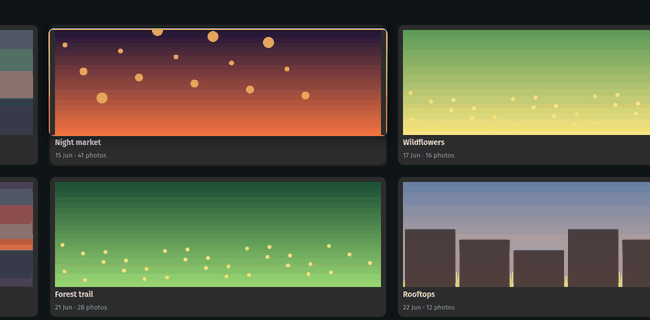
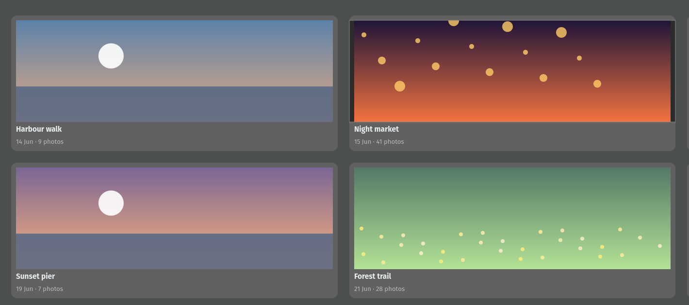
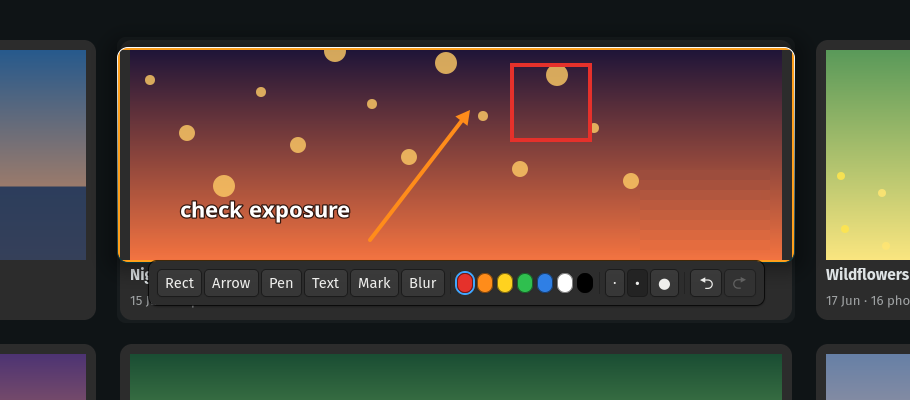
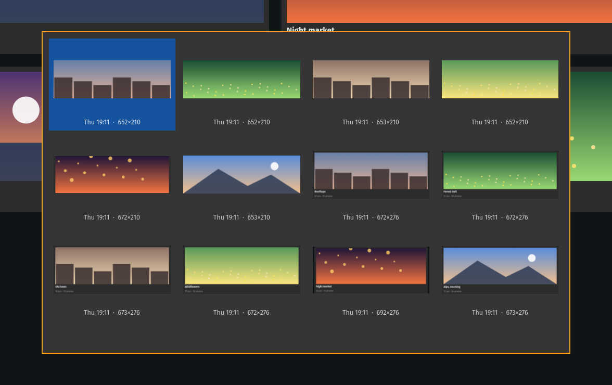

# snip-pin

[](https://github.com/felsenuboot/snip-pin/actions/workflows/ci.yml)

Snipaste-style **snip and pin** for [Hyprland](https://hyprland.org). Press a
key, pick a region, a window or an element inside a window, and the screenshot
stays on screen exactly where it was taken, floating above everything. Drag it
around, zoom it, fade it, annotate it, copy or save it.

<p align="center">
  
</p>

> [!NOTE]
> **This tool was written mostly by an AI.** Nearly all of the code was produced
> by Claude Code (Anthropic's coding agent) under my direction. I read and test
> what it writes and use the tool daily, but nobody has audited it. It works on
> my machine: Arch Linux, Hyprland 0.56 with the Lua config, GTK 4.22. Use it at
> your own risk; there is no warranty of any kind. Issues and pull requests are
> welcome. This project is not affiliated with Snipaste or Hyprland.

## What it does

| Snap to windows and elements | Annotate on the pin |
|---|---|
|  |  |
| Windows and the rectangles inside them (images, cards, panels) highlight under the pointer. A click snaps to one, a drag selects freely, right-click or `Esc` aborts. | The pin is the editor: rectangle, arrow, pen, text, marker and blur, baked into what you copy or save. The file on disk stays untouched. |

- **Pins stay put.** Every snip opens as a floating, pinned window at the
  capture position and shows up in the dock like any other window.
- **Clipboard first.** Every snip lands in the clipboard as well. Right-click
  or `Ctrl+C` on a pin copies it again, annotations included, and closes it.
- **History.** Snips are kept for a week, or for good if you star them: pin
  the last one again, pick one from a thumbnail grid, or pin the image that is
  in the clipboard.
- **No daemon, no portal.** `slurp`, `grim` and `wl-copy` plus a GTK4 viewer.
  All pins share one process, so a second pin appears in about 100 ms.

## Install

```
sudo pacman -S --needed grim slurp wl-clipboard jq python-gobject gtk4 hyprpicker python-numpy
git clone https://github.com/felsenuboot/snip-pin ~/.local/share/snip-pin
~/.local/share/snip-pin/install.sh
```

`hyprpicker` (freezes the screen during selection), `python-numpy` (element
snapping) and `libnotify` (toasts) are optional. `install.sh` adds a desktop
entry and icon so docks show a proper icon for pins.

Bind the script and add a window rule so pins float above everything without
animations, blur, shadows or rounded corners. Hyprland Lua config (0.56+):

```lua
hl.bind("PRINT", hl.dsp.exec_cmd("~/.local/share/snip-pin/snip-pin.sh"), { description = "Snip a region and pin it" })
hl.bind("SHIFT + PRINT", hl.dsp.exec_cmd("~/.local/share/snip-pin/snip-pin.sh last"), { description = "Pin the last snip again" })
hl.bind("SUPER + PRINT", hl.dsp.exec_cmd("~/.local/share/snip-pin/snip-pin.sh history"), { description = "Snip history" })
hl.bind("CTRL + PRINT", hl.dsp.exec_cmd("~/.local/share/snip-pin/snip-pin.sh clipboard"), { description = "Pin the clipboard image" })

hl.window_rule({
    name = "snip-pin",
    match = { class = "^(snip-pin)$" },
    float = true,
    pin = true,
    no_anim = true,
    no_blur = true,
    no_shadow = true,
    border_size = 0,
    rounding = 0,
})
```

<details>
<summary>Classic <code>hyprland.conf</code></summary>

```
bind = , PRINT, exec, ~/.local/share/snip-pin/snip-pin.sh
bind = SHIFT, PRINT, exec, ~/.local/share/snip-pin/snip-pin.sh last
bind = SUPER, PRINT, exec, ~/.local/share/snip-pin/snip-pin.sh history
bind = CTRL, PRINT, exec, ~/.local/share/snip-pin/snip-pin.sh clipboard

windowrulev2 = float, class:^(snip-pin)$
windowrulev2 = pin, class:^(snip-pin)$
windowrulev2 = noanim, class:^(snip-pin)$
windowrulev2 = noblur, class:^(snip-pin)$
windowrulev2 = noshadow, class:^(snip-pin)$
windowrulev2 = noborder, class:^(snip-pin)$
windowrulev2 = rounding 0, class:^(snip-pin)$
```

The placement call uses the Lua dispatcher syntax; on Hyprland releases older
than 0.56 replace `hl.dsp.window.move(...)` in `pin-view.py` with
`movewindowpixel exact X Y,address:...`.

</details>

## Using a pin

| Action | Input |
|---|---|
| Move | drag with the left mouse button |
| Zoom | mouse wheel (10 % steps), `Ctrl+0` resets |
| Opacity | `Ctrl` + wheel, `Ctrl+1` resets |
| Copy image and close | `Ctrl+C`, double-click or right-click |
| Save to the screenshot folder and close | `Ctrl+S` or the middle-click menu |
| Close without copying | `Esc` |

A toolbar appears under the pin while the pointer is over it. Pick a tool and
draw with the left mouse button; with no tool selected the pin moves as usual.

| Tool | Key | Notes |
|---|---|---|
| Rectangle | `R` | outline |
| Arrow | `A` | drag from tail to head |
| Pen | `P` | freehand |
| Text | `T` | click to place, type, `Enter` commits |
| Marker | `M` | wide, semi-transparent highlighter |
| Blur | `B` | pixelates a rectangle, for hiding secrets |

Colour: `1`–`7` or the swatches. Stroke width: `[` / `]` or the three dots
(also sets text size and blur block size). Undo / redo: `Ctrl+Z` /
`Ctrl+Shift+Z`. Deselect a tool with its key again, its button or `Esc`.

## History



Every snip is kept in `~/.cache/snip-pin` for seven days. Snips you mark as
kept (★) move to a `kept` subfolder and never expire. The file name carries
the capture position, so `last` puts the snip back where it was taken; pins
opened from the picker appear centred.

| Command | What it does |
|---|---|
| `snip-pin.sh last` | pin the newest snip again, where it was taken |
| `snip-pin.sh history` | open a thumbnail grid of all cached snips, newest first |
| `snip-pin.sh clipboard` | pin the image in the clipboard, centred on the screen |
| `snip-pin.sh clear` | delete every snip that is not kept |

Pressing the snip key twice quickly also opens the history: the second press
aborts the selection the first one started. In the picker, click or use the
arrow keys to select a snip; double-click or `Enter` pins it, right-click
copies it to the clipboard, `K` keeps or unkeeps it, `Delete` removes it,
`Esc` closes. The "Clear history" button
asks once, then deletes everything that is not kept.

## Configuration

Everything is read from the environment of the bound command.

| Variable | Default | Meaning |
|---|---|---|
| `SNIP_PIN_KEEP_DAYS` | `7` | days to keep snips; `0` keeps them forever |
| `SNIP_PIN_TAP_MS` | `300` | double-tap window for opening the history |
| `SNIP_PIN_BORDER` | `#ff9f1c` | colour of the 2 px border a pin draws around itself |

`Ctrl+S` saves to the folder named in `~/.config/ml4w/settings/screenshot-folder`
if that file exists (ML4W dotfiles), otherwise to `~/Pictures`.

<details>
<summary>Design notes and testing</summary>

- **Four files.** `snip-pin.sh` freezes the screen, feeds `slurp` with window
  and element rectangles, captures with `grim`, copies with `wl-copy` and
  launches the viewer. `snip-elements.py` finds the elements (long horizontal
  and vertical luminance edges joined into rectangles, the way Snipaste does)
  in pure numpy, about 40 ms on a 3440×1440 frame while the screen is frozen.
  `pin-view.py` is the viewer and annotation editor. `pin-history.py` is the
  thumbnail picker.
- **Elements without contrast** (a dark photo on a dark page) cannot be found
  by edge detection. slurp highlights the smallest rectangle under the pointer,
  so an element wins over its window. Nothing is detected while `python-numpy`
  is missing; windows still snap.
- **One process for all pins.** The first viewer listens on a socket in
  `$XDG_RUNTIME_DIR`; later ones hand their arguments over and exit before GTK
  is imported. Closing a pin never touches the others.
- **Why a toplevel window and not a layer surface.** A layer surface could
  position itself and would need no window rule, but it has no app id in docks,
  cannot be pinned per workspace and would need hand-made dragging. Pins are
  meant to behave like windows, so they are windows; Hyprland places them.
- **Why Python.** GTK 4 and the GL driver dominate start-up and memory; the
  language is not the cost, and the single-process model removes the start-up
  for every pin but the first.
- **Why not Flameshot.** On Wayland its pin widget cannot size or place its own
  window, and the capture goes through the screenshot portal, which costs over
  a second on a large screen.
- **Testing without a mouse.** `SNIP_GEOM=400x300+600+400 ./snip-pin.sh` pins
  that region directly; `SNIP_NO_ELEMENTS=1` snaps to windows only;
  `grim -s 1 -t ppm - | ./snip-elements.py --debug out.png` draws the detected
  edges and rectangles onto a copy of the screen.

</details>

## License

MIT
